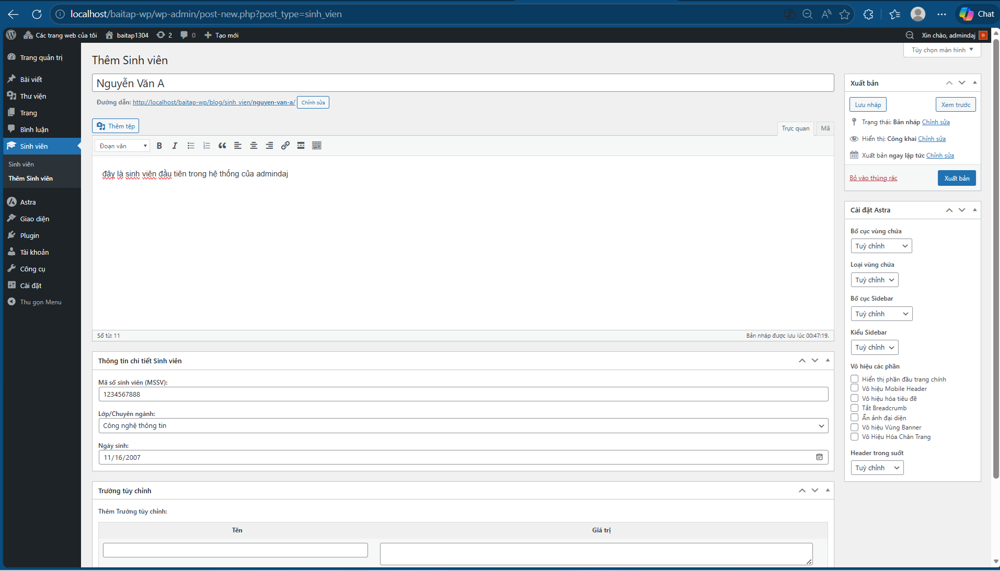
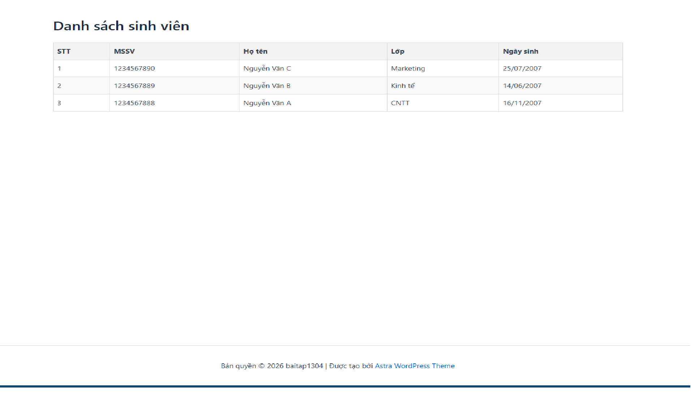

# Student Manager Plugin

Đây là bài tập xây dựng plugin quản lý sinh viên trên nền tảng WordPress.

## Tính năng
- **Backend**: Đăng ký Custom Post Type `sinh_vien`.
- **Meta Boxes**: Cho phép nhập liệu MSSV, Lớp, Ngày sinh. Dữ liệu được bảo mật với Nonce và sanitize.
- **Frontend**: Hiển thị bảng danh sách sinh viên qua shortcode `[danh_sach_sinh_vien]`.

## Cài đặt
1. Tải source code dưới dạng `.zip`.
2. Vào màn hình quản trị WordPress -> Plugins -> Add New -> Upload Plugin.
3. Chọn file `.zip` vừa tải và kích hoạt plugin.
4. Tạo một Page mới và dán shortcode `[danh_sach_sinh_vien]` vào nội dung.

## Ảnh chụp màn hình kết quả

